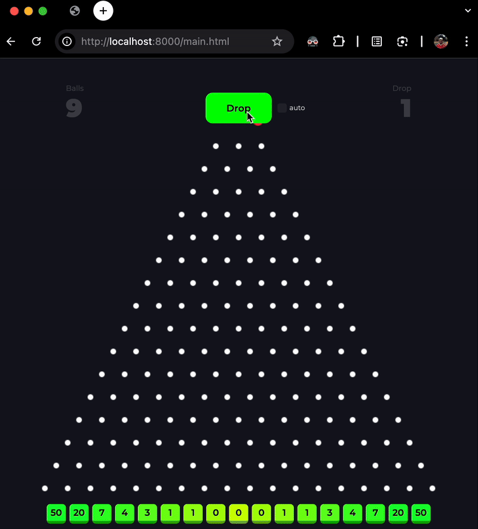

# Plinko Game

A browser-based Plinko game with physics simulation and musical notes. Drop balls and watch them bounce through pegs to land in different multiplier slots!

## Demo



## Features

- Physics-based ball dropping using Matter.js
- Musical notes that play when balls hit the bottom using Tone.js
- Automatic ball dropping mode
- Multiplier system for ball rewards
- Animated peg effects when balls collide

## How to Run

### Method 1: Simple Local Server (Recommended)

1. **Using Python** (if you have Python installed):

   ```bash
   # Navigate to the project directory
   cd /Users/faustozamparelli/Plinko

   # For Python 3:
   python -m http.server 8000

   # For Python 2:
   python -m SimpleHTTPServer 8000
   ```

2. **Using Node.js** (if you have Node.js installed):

   ```bash
   # Install a simple HTTP server globally
   npm install -g http-server

   # Navigate to the project directory and start server
   cd /Users/faustozamparelli/Plinko
   http-server
   ```

3. **Using PHP** (if you have PHP installed):

   ```bash
   cd /Users/faustozamparelli/Plinko
   php -S localhost:8000
   ```

4. **Open in browser**: Navigate to `http://localhost:8000` and open `main.html`

### Method 2: Live Server Extension (VS Code)

If you're using VS Code:

1. Install the "Live Server" extension
2. Right-click on `main.html`
3. Select "Open with Live Server"

### Method 3: Direct File Opening (Not Recommended)

Due to CORS restrictions with loading external scripts, opening the HTML file directly in a browser may not work properly. Use one of the server methods above instead.

## How to Play

1. **Drop Mode**: Click the "Drop" button to drop individual balls
2. **Auto Mode**: Check the checkbox next to the drop button to enable auto-dropping
3. **Start/Stop**: In auto mode, the button becomes a Start/Stop toggle
4. **Multipliers**: Balls land in slots with different multipliers (from 0.3x to 110x)
5. **Audio**: Each slot plays a different musical note when hit
6. **Ball Count**: Watch your ball count increase based on the multipliers

## Game Mechanics

- Balls start with 10 balls
- Each ball dropped reduces your count by 1
- Landing in multiplier slots awards balls based on the multiplier value
- Pegs light up when hit by balls
- Musical notes correspond to different slots

## Dependencies

The game uses CDN-hosted libraries:

- **Matter.js**: Physics engine for realistic ball movement
- **Tone.js**: Web audio library for musical notes
- **Montserrat Font**: Google Fonts for typography

## Controls

- **Drop Button**: Drop a single ball
- **Auto Checkbox**: Enable/disable automatic ball dropping
- **Start/Stop**: Control auto-dropping when enabled

Enjoy the game! 🎮
